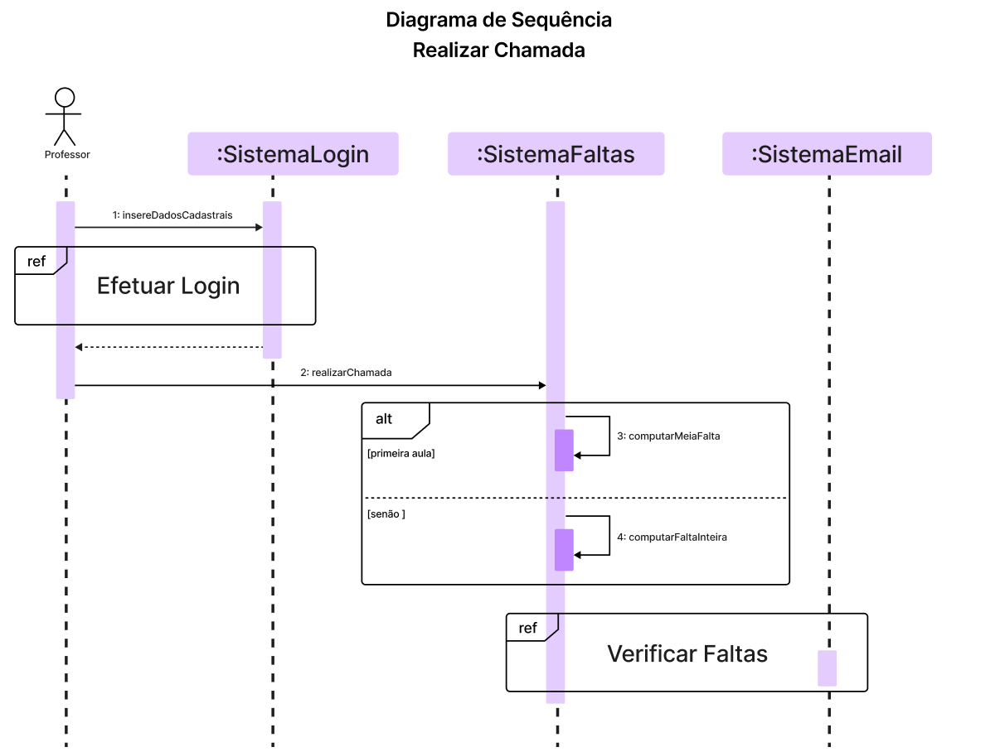
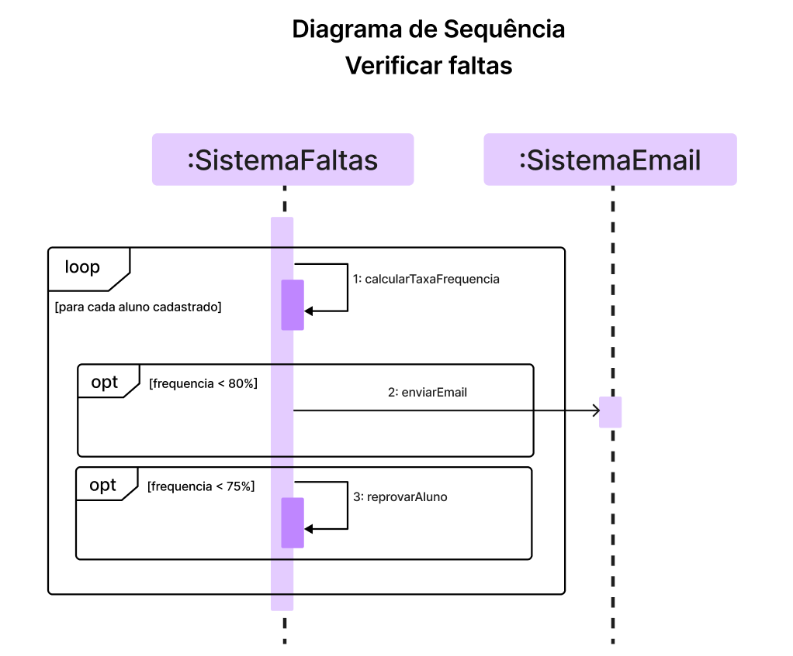
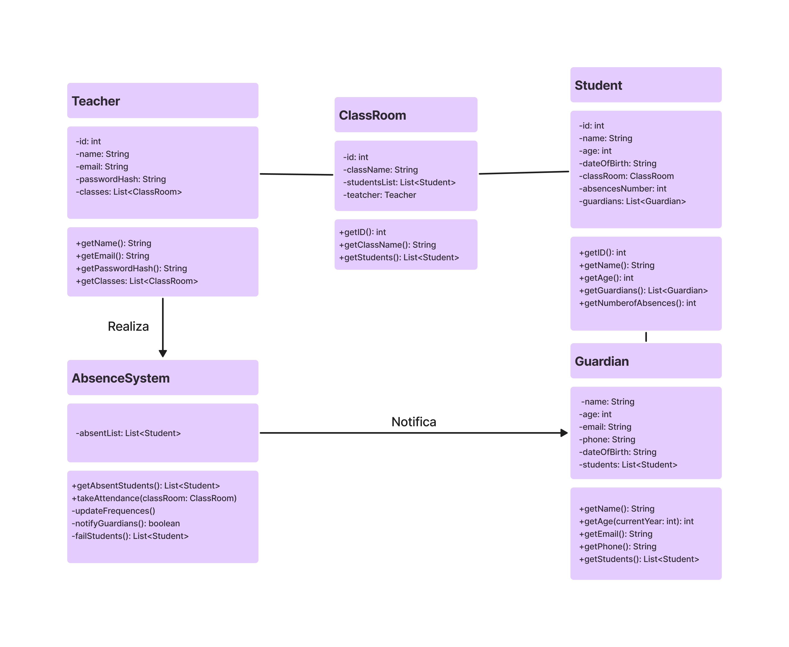
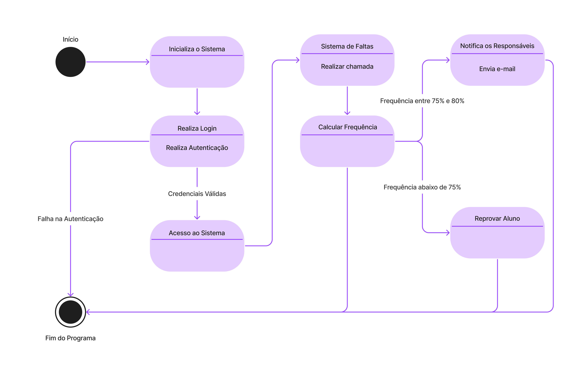

<h2><a href= "https://www.mackenzie.br">Universidade Presbiteriana Mackenzie</a></h2>
<h3><a href= "https://www.mackenzie.br/graduacao/sao-paulo-higienopolis/ciencia-da-computacao">Ciência da Computação</a></h3>

*&lt;Escola Quântica Tecnológica: Presença&gt;*

**Conteúdo**

- [Autores:](#autores)
- [Descrição do Projeto](#descrição-do-projeto)
- [Análise de Requisitos Funcionais e Não-Funcionais](#análise-de-requisitos-funcionais-e-não-funcionais)
- [Diagrama de Atividades](#diagrama-de-atividades)
- [Diagrama de Casos de Uso](#diagrama-de-casos-de-uso)
- [Descrição dos Casos de Uso](#descrição-dos-casos-de-uso)
  - [Caso de Uso: Fazer Login](#caso-de-uso-fazer-login)
  - [Caso de Uso: Fazer Chamada](#caso-de-uso-fazer-chamada)
- [Diagrama de Sequência](#diagrama-de-sequência)
  - [Realizar Chamada](#realizar-chamada)
  - [Efetuar Login](#efetuar-login)
  - [Verificar Faltas](#verificar-faltas)
- [Diagrama de Classes](#diagrama-de-classes)
- [Diagrama de Estados](#diagrama-de-estados)
- [Diagrama de Implantação](#diagrama-de-implantação)
- [Referências](#referências)

# Autores:

* Gustavo Vilela Mitraud
* Sabrina Midori Futami Teixeira de Carvalho
* João Pedro Rodrigues Vieira 

# Descrição do Projeto

O seguinte grupo tem como objetivo modelar um projeto que visa implementar um sistema de contabilização de faltas dos alunos da Escola Quântica Tecnológica. A seguir, serão explicitados os mais diversos diagramas, que dissecarão os modos como o sistema deve se comportar.

# Análise de Requisitos Funcionais e Não-Funcionais
**Requisitos Funcionais**
1. Cada professor deve possuir um cadastro e se identificar para ter acesso às funcionalidades do sistema;
2. O sistema deve realizar uma dupla autenticação para que o professor acessar a plataforma;
3. O sistema deve contabilizar as ausências dos alunos em um banco de dados duas vezes ao dia, sendo que cada ausência será computada como meia falta;
4. O sistema deve calcular a frequência do aluno com base na quantidade de faltas armazenadas no banco de dados e no número total de aulas prevista para o ano letivo;
5. O sistema deve notificar, por e-mail, os pais ou responsáveis quando a porcentagem de comparecimento às aulas dadas até o momento estiver abaixo de 80%;
6. O aluno com mais de 25% de faltas deve ser automaticamente reprovado.

**Requisitos Não Funcionais**
1. O sistema deve contar com ferramentas de acessibilidade (tamanho de fonte, cor de fonte e leitores de tela);
2. O sistema deve ser implementado em web;
3. O sistema deve ser responsivo;
4. O sistema deve ser fácil de navegar, com um design intuitivo, claro e consistente;
5. O sistema deve permitir o acesso por meio de dispositivos móveis;
6. O sistema deve realizar backup dos dados (*online* e *offline*);
7. O sistema deve permitir múltiplos acessos simultâneos.
# Diagrama de Atividades

# Diagrama de Casos de Uso

# Descrição dos Casos de Uso

## Caso de Uso: Fazer Login 
- **Ator Principal**: Professor 
- **Pré Condições**: Professor deve estar cadastrado no sistema 
- **Pós Condições:** Professor faz login no sistema e as funções de fazer chamada são disponibilizadas para ele 
- **Fluxo:**
- 1. (Professor) (Opcional) Professor escolhe as opções de acessibilidade
- 2. (Sistema) (Opcional) Sistema muda sua interface de acordo com a opção escolhida 
- 3. (Professor) Professor preenche suas credênciais nos campos de login e senha
- 4. (Sistema) Sistema libera acesso ao professor caso suas credênciais estejam corretas 
- 4. (Sistema) Sistema exibe uma mensagem de erro caso as credências estejam incorretas 

## Caso de Uso: Fazer Chamada 
- **Ator Principal:** Professor 
- **Pré Condições:** Professor deve fazer Login no sistema  
- **Pós Condições:** A chamada é computada no sistema 
- **Fluxo:** 
- 1. (Professor) (Opcional) Professor muda as configurações de acessibilidade 
- 2. (Sistema) (Opcional) Sistema muda sua interface por causa da acessibilidade 
- 3. (Professor) Professor realiza a chamada, selecionando os alunos que não estão presente na aula 
- 4. (Sistema) Caso seja a primeira aula, sistema computa meia falta para os alunos não presentes 
- 4. (Sistema) Caso seja a segunda aula, sistema computa falta inteira para os alunos não presentes 
- 5. (Sistema) Sistema verifica automaticamente se deve enviar o relatorio de faltas para os pais 
- 6. (Sistema) Sistema verifica automaticamente se deve reprovar um aluno por falta 

# Diagrama de Sequência

## Realizar Chamada

## Efetuar Login

## Verificar Faltas

# Diagrama de Classes

# Diagrama de Estados

# Diagrama de Implantação

[Diagrama de Implementação](../src/IMPLEMENTATION-DIAGRAM.drawio.png)

# Referências

- PRESSMAN, Roger S.; MAXIM, Bruce R. Engenharia de software. [Digite o Local da Editora]: Grupo A, 2021. E-book. ISBN 9786558040118. Disponível em: https://app.minhabiblioteca.com.br/#/books/9786558040118/. Acesso em: 01 jun. 2024.
